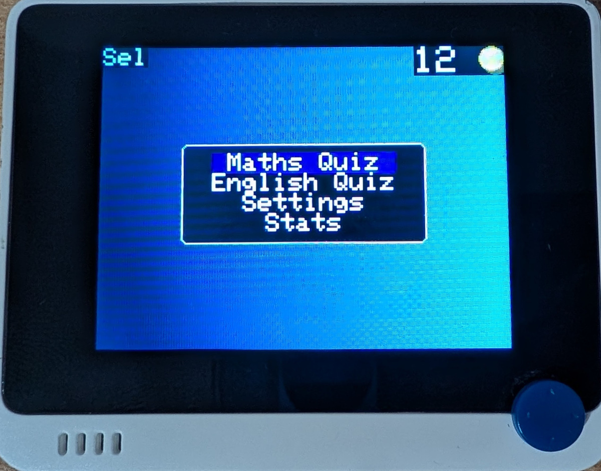
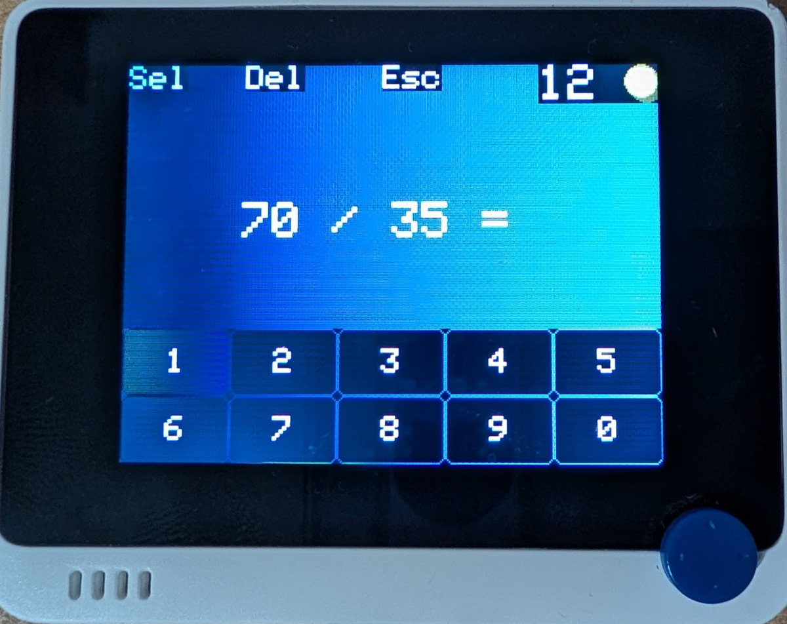
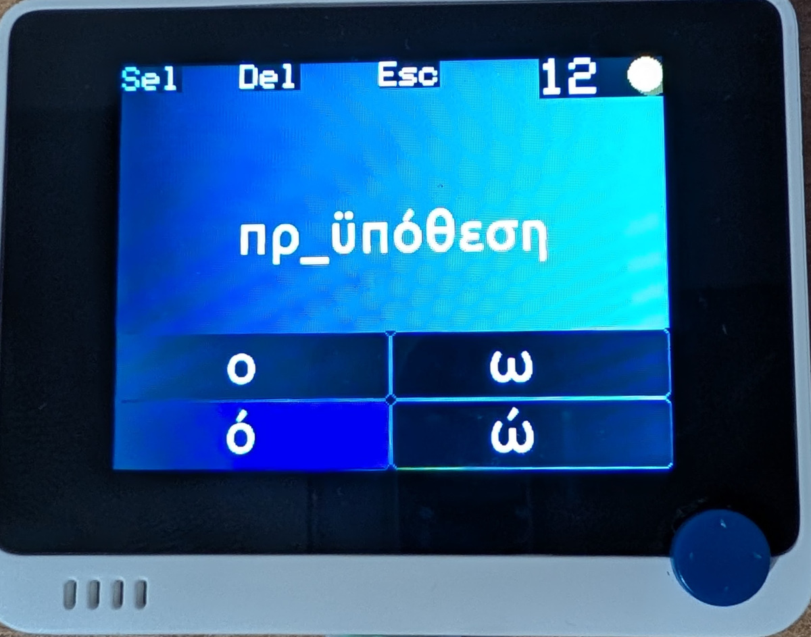
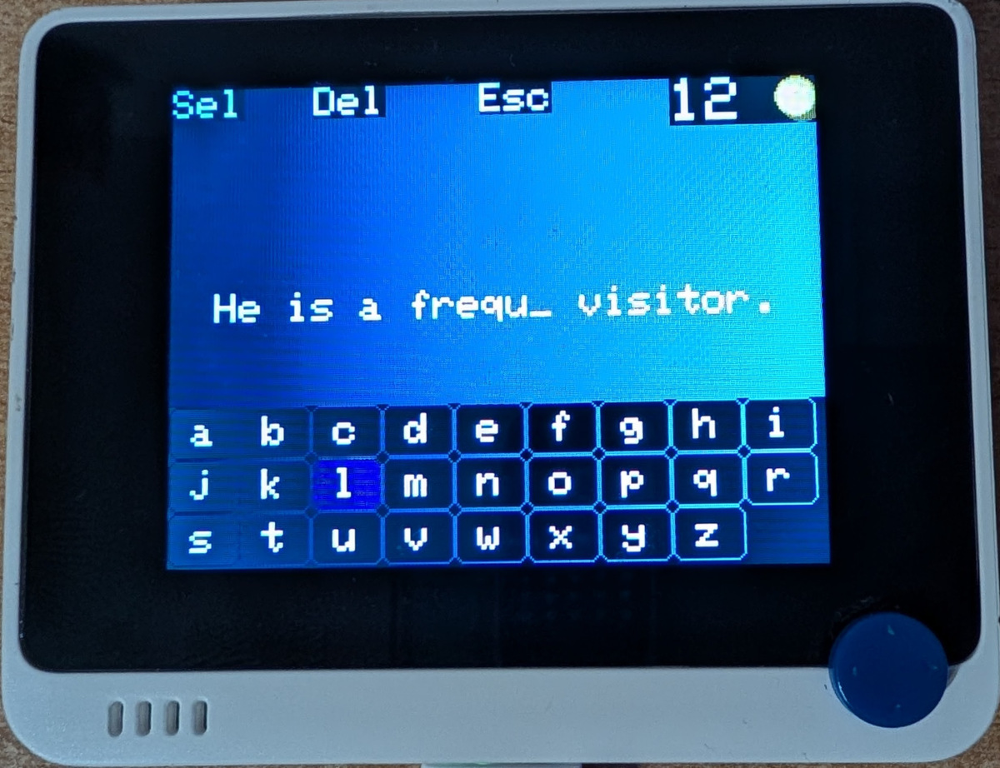
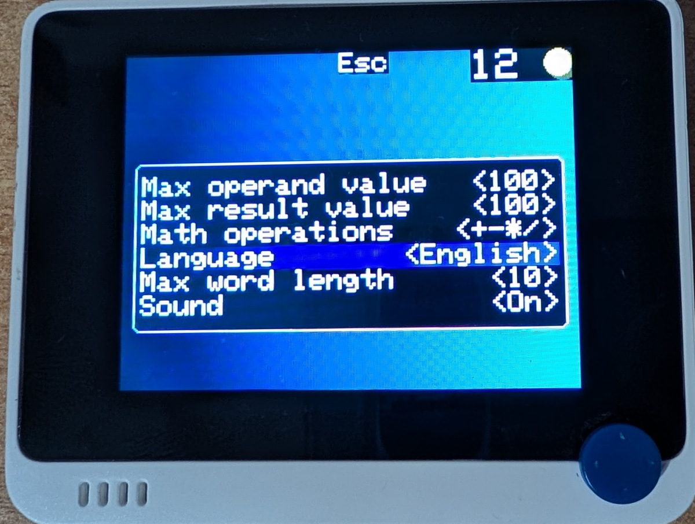
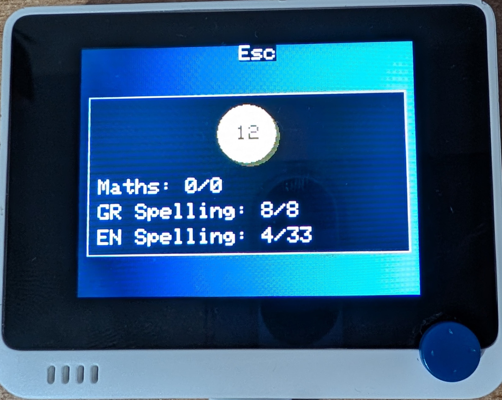

# drachmath

Solve. Spell. Reward. 💰

## What?

Ever heard of drachmas? 🪙 
Well `drachmath` is not the old Greek currency with a... lisp, but a game that trains your kids in
maths and spelling while they earn pocket money. 
The concept is simple: Kids solve math and spelling problems and earn "coins" for each correct answer.
The kid shows their score and the coins can be exchanged for money or other rewards by their parents.
Once the "transaction" is complete, the device is reset and the game can start over again.
The problems are generated randomly and can be customized to suit the child's learning level.
Currently, **addition, subtraction, multiplication and division** problems are supported,
as well as **spelling in Greek and English**.

`drachmath` runs on Seeed Studio's [Wio Terminal](https://wiki.seeedstudio.com/Wio-Terminal-Getting-Started/).
It is a small, portable device with a TFT screen and buttons that can be programmed to run whatever you want.
`drachmath` works on other Arduino-compatible devices as well,
but you would first need to make slight modifications to the code.

     

## Why?

The inspiration for `drachmath` came from my own experience as a child.
My father created a [similar game for me in QBasic](https://github.com/platisd/qbasic-spelling-maths) in the 1990s.
For each correct answer I would earn, literally, a drachma.
While my motive back then was rather selfish, it gamified my learning and motivated me enough to practice in maths and spelling.

30 years later, I thought of creating a similar game but adjusted to the modern times
and how children interact with technology.
Specifically, **I did not want to increase screen time for kids**. 
This is why `drachmath` is not an app you can play on your phone or computer.
Instead, it works on small, single-purpose devices (like Wio Terminal) that can "not" be used for anything else.
At least not until they learn how to program the Wio Terminal themselves, which is not a bad idea at all. 😂

## How?

`drachmath` is an Arduino (C++) sketch that is designed to run on Wio Terminal.
With some modifications, it could run on other Arduino-compatible devices as well since there are not any
dependencies on custom-made hardware or the Wio Terminal's microcontroller.

`drachmath.ino` contains the game's transition flows, while the quiz-related code is found in header file(s).
Almost everything not in the `drachmath.ino` file is a class or function template.
As a result, code might be somewhat difficult to read and feel over-engineered.
To be honest, both of your assessments are correct.
I wanted to experiment with making things "generic" and "reusable", even though I knew it is very unlikely
the same code will be used in another project or platform.
Additionally, I avoided using the C++ STL despite Wio Terminal supporting quite a lot of it.
The purpose was to make the code easy to port to other Arduino-compatible devices, with more limited resources,
that might not have STL support. Again, this is all theoretical and done for the sake of experimentation and
practice, something crucial in the age of LLMs.

Overall, the user interface starts with a main menu which allows the user to enter the maths or the currently
selected spelling quiz. There is a settings menu, enabling the user to change the difficulty of the problems
among other things. The user can also view their stats, i.e. their current score and the number of correct
and incorrect attempts for each quiz.
Settings are saved persistently if a MicroSD card is present.
The MicroSD card is also required for the spelling quizzes since the word lists and the Greek font are
stored there.

Navigation is done via Wio Terminal's buttons (3 on top) and the 5-way joystick. There is a battery
indicator on the top right corner of the screen, under the score label, visible when the device
is powered up by the Wio Terminal Chassis Battery.
The battery is not required for `drachmath` to work, but if you want to make the device truly portable,
I highly recommend it.

### Software

- [Arduino IDE](https://www.arduino.cc/en/software) to flash the code
- `drachmath` code (this [repository](https://github.com/platisd/drachmath))
- [Seeed Studio's TFT_eSPI library](https://github.com/Seeed-Studio/Seeed_GFX)
  - [Small patch to display smooth fonts](https://wiki.seeedstudio.com/Wio-Terminal-LCD-Anti-aliased-Fonts/#configuring-the-lcd-library)
- [Seeed Studio's Filesystem library](https://github.com/Seeed-Studio/Seeed_Arduino_FS)
- [Seeed Studio's SFUD library](https://github.com/Seeed-Studio/Seeed_Arduino_SFUD)
- [SparkFun's Fuel Gauge library](https://github.com/sparkfun/SparkFun_BQ27441_Arduino_Library)
- [sd](sd) directory contents copied to the root of a FAT32-formatted MicroSD card
  - [Greek word list](sd/greek_words.txt)
    - LLM generated
  - [English word list](sd/english_words.txt)
    - [Anki](https://apps.ankiweb.net/) database dump and LLM generated
  - [Greek font](sd/ubuntu-greek-latin-32.vlw)

### Hardware

- [Wio Terminal](https://www.seeedstudio.com/Wio-Terminal-p-4509.html?sensecap_affiliate=b3Dtz45&referring_service=link) (affiliate link)
- [Wio Terminal Battery](https://www.seeedstudio.com/Wio-Terminal-Chassis-Battery-650mAh-p-4756.html?sensecap_affiliate=b3Dtz45&referring_service=link) (affiliate link)
- MicroSD card (for persistent settings, Greek font and word lists)
